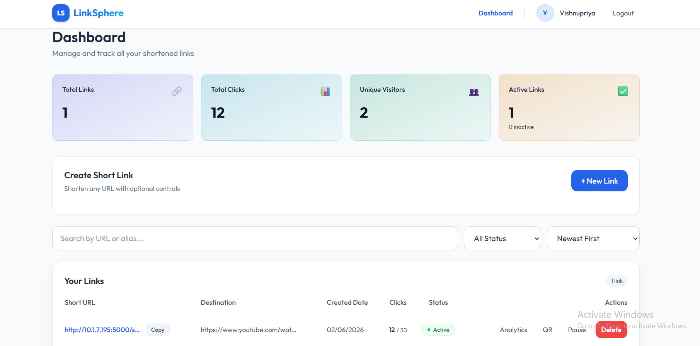
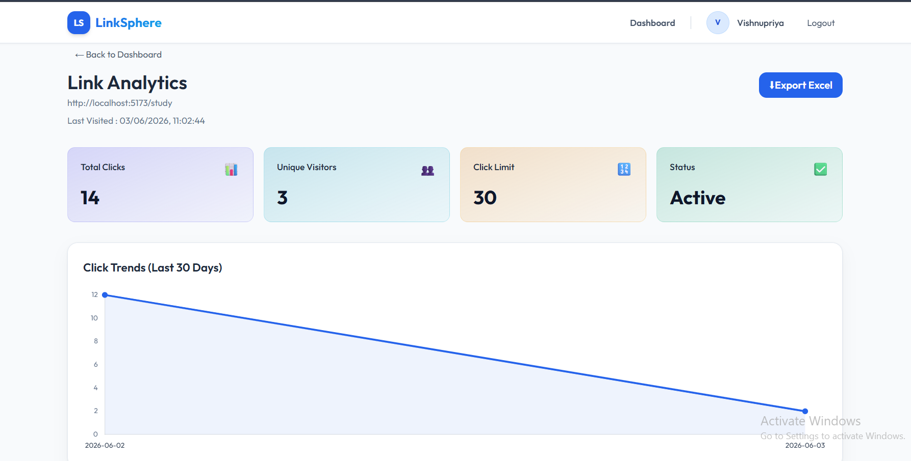
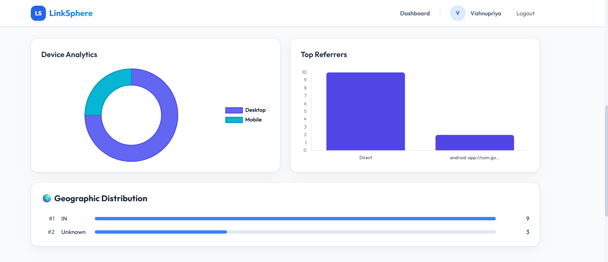
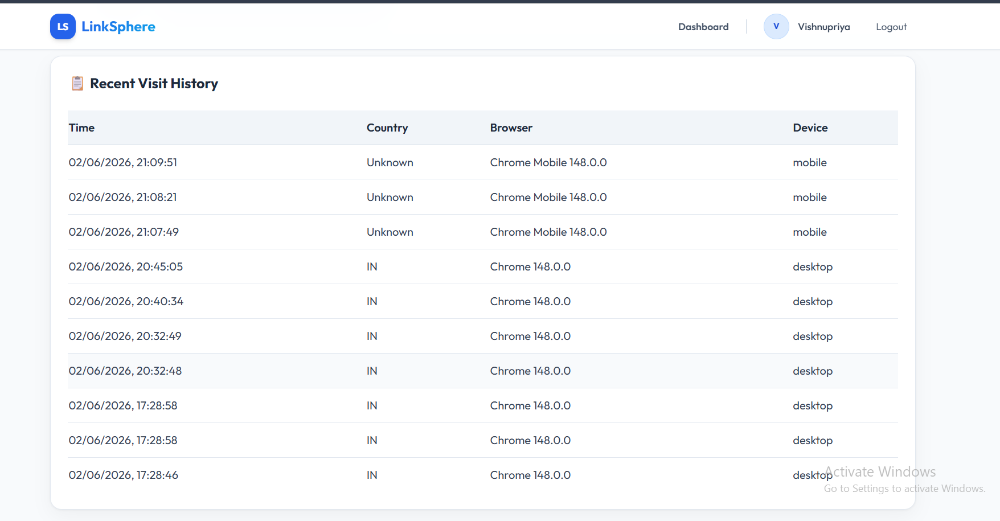
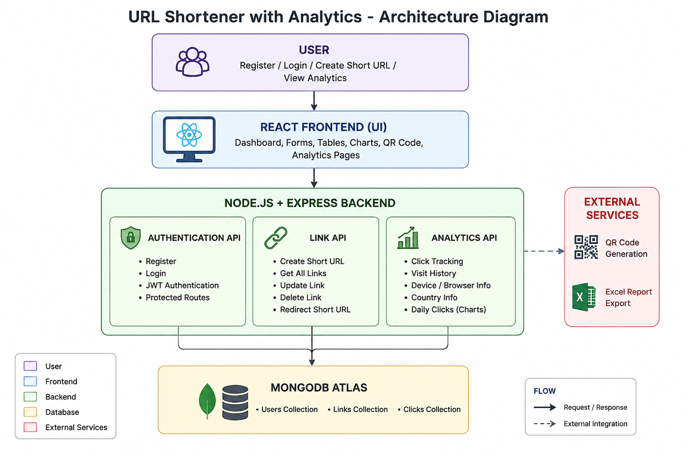

# LinkSphere - URL Shortener with Analytics

## Project Overview

LinkSphere is a full-stack URL Shortener and Analytics platform built using React, Node.js, Express.js, and MongoDB Atlas.

The platform allows users to create short URLs, manage links securely, generate QR codes, track visitor analytics, monitor click trends, and export reports through an interactive dashboard.

The primary goal of this project is to provide a simple and efficient URL shortening service while offering valuable insights into user engagement and link performance.

---

## Features

### Authentication

* User Registration
* User Login
* JWT-based Authentication
* Protected Routes
* Secure Password Hashing using bcrypt

### URL Management

* Create Short URLs
* Unique Short Code Generation
* Redirect to Original URL
* Copy Short URL
* Delete Short URL
* Click Limit Support

### Analytics

* Total Click Count
* Unique Visitors Count
* Last Visited Time
* Recent Visit History
* Device Analytics
* Browser Analytics
* Geographic Analytics
* Daily Click Trend Charts

### Additional Features

* QR Code Generation
* Excel Report Export
* Responsive Dashboard
* Public Analytics Access
* Clean and Modern UI

---

## Tech Stack

### Frontend

* React.js
* React Router DOM
* Tailwind CSS
* Chart.js
* React ChartJS 2
* Axios

### Backend

* Node.js
* Express.js
* JWT Authentication
* bcrypt

### Database

* MongoDB Atlas
* Mongoose ODM

### Additional Libraries

* qrcode.react
* exceljs
* ua-parser-js

---

## System Architecture

The application follows a client-server architecture.

### Flow

User → React Frontend → Express Backend → MongoDB Atlas

The backend contains:

* Authentication API
* Link Management API
* Analytics API

---

## API Endpoints

### Authentication

```http
POST /api/auth/register
POST /api/auth/login
```

### Links

```http
POST /api/links
GET /api/links
DELETE /api/links/:id
GET /:shortCode
```

### Analytics

```http
GET /api/analytics/:id
GET /api/analytics/public/:shortCode
GET /api/analytics/export/:id
```

---

## Setup Instructions

### Clone Repository

```bash
git clone <repository-url>
```

### Backend Setup

```bash
cd backend
npm install
npm run dev
```

### Frontend Setup

```bash
cd frontend
npm install
npm run dev
```

### Environment Variables

Create a `.env` file inside the backend folder:

```env
PORT=5000
MONGO_URI=your_mongodb_connection_string
JWT_SECRET=your_secret_key
CLIENT_URL=http://localhost:5173
```

---

## Screenshots

### Dashboard



### Analytics Page







---

## Architecture Diagram



---

## Assumptions

* Every generated short URL is unique.
* MongoDB Atlas is used as the primary database.
* JWT is used for user authentication.
* Analytics data is stored for every redirect.
* Users can access only their own links.
* Passwords are securely hashed before storage.

---

## Sample Database Entries

### User Collection

```json
{
  "name": "Vishnupriya",
  "email": "vishnu7797jk@example.com"
}
```

### Link Collection

```json
{
  "originalUrl": "https://www.google.com",
  "shortCode": "abc123",
  "totalClicks": 12
}
```

### Click Collection

```json
{
  "country": "IN",
  "device": "desktop",
  "browser": "Chrome",
  "timestamp": "2026-06-02T20:45:05Z"
}
```

---

## Project Workflow

### Planning Phase

* Requirement Analysis
* Database Design
* API Structure Planning
* Frontend Component Planning

### Development Phase

* Authentication Module Development
* URL Shortening Module Development
* Analytics Tracking System
* Dashboard UI Development
* QR Code Integration
* Excel Export Integration

### Testing Phase

* Authentication Testing
* URL Redirection Testing
* Analytics Validation
* QR Code Testing
* Export Functionality Testing

---

## Future Improvements

* Custom URL Alias
* Link Expiry Date
* Bulk URL Creation using CSV
* Advanced Analytics Dashboard
* Dark Mode Support
* Email Notifications
* Team Collaboration Features

---

## Demo Video

YouTube Video Link:

(Add Your YouTube or Loom Video Link Here)

---

## Author

**Vishnupriya**

B.Tech Information Technology

---

This project is a part of a hackathon run by https://katomaran.com

